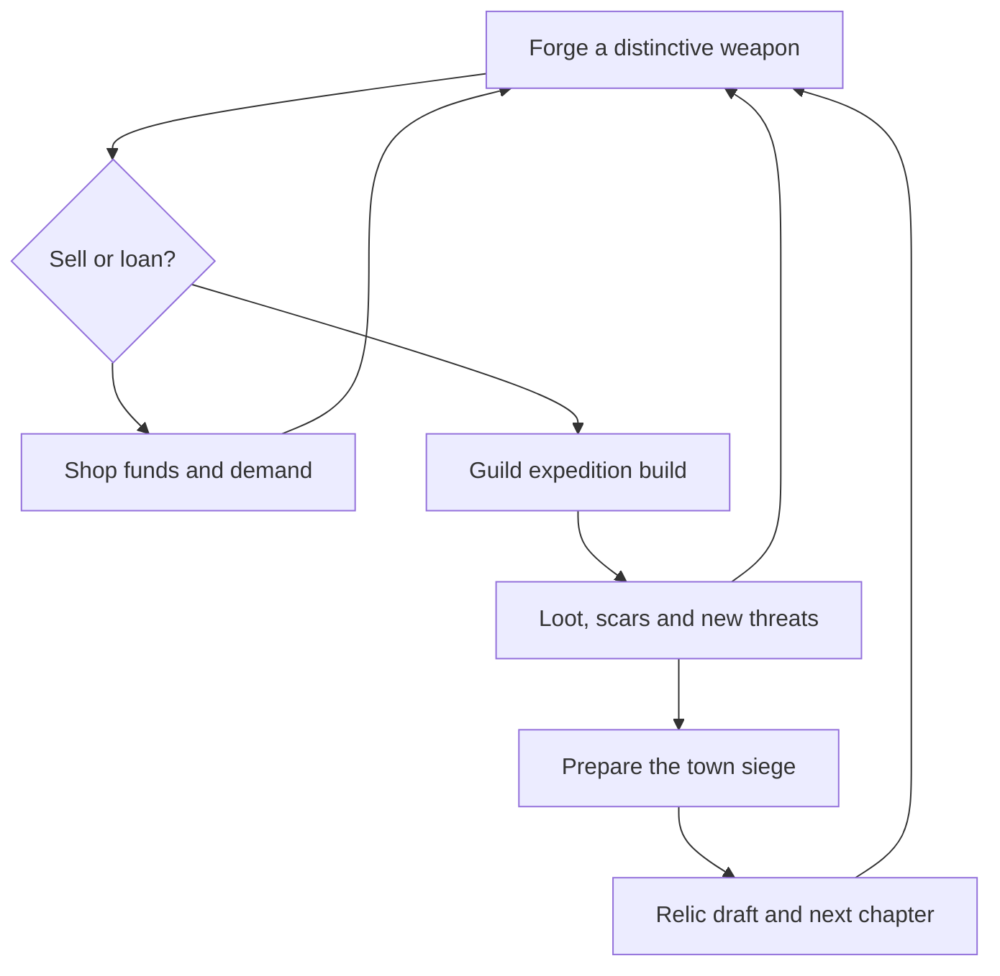

# Blacksmith Inc. — Adventurers’ Guild & Roguelite Evolution Plan

**Prepared:** 10 October 2026, Europe/Amsterdam  
**Reviewed repository:** [Morfildor/BlacksmithInc](https://github.com/Morfildor/BlacksmithInc)  
**Final reviewed baseline:** [`f026050427803456d6491c32e66ef2574e8ad8dc`](https://github.com/Morfildor/BlacksmithInc/commit/f026050427803456d6491c32e66ef2574e8ad8dc), pushed `main`, commit dated 23:15:02 +02:00. Re-fetched after the owner reported a new push and again after “Continue.” Includes the UI polish merge and gameplay-depth implementation (`1056157`, originally branch `7bac2de`).  
**Baseline versions:** app 0.7.0 / versionCode 7; rules 4; balance 10; content 4; save schema 5. The initial review used `44af915`; findings below have been reconciled with the new push.  
**Status:** Design and implementation proposal. No game code changed, committed, or pushed. All new mechanics, numbers, schedules, and success targets below are proposed unless explicitly described as existing.

## Read this first

**Turn Blacksmith Inc. into a game about building an irresponsible little guild around extraordinary weapons.** You forge, sell, recruit, lend equipment, assemble expedition teams, and decide which problems to confront. Your adventurers fight automatically. Their injuries, discoveries, grudges, and lost weapons create tomorrow’s decisions.

The strongest new question is:

> “Do I sell this ridiculous sword to save the business, or send my favourite idiot into a crypt with it?”

The recommended design has three connected engines:

1. **Guild decisions:** a small roster, limited expedition capacity, equipment loans, and meaningful deployment choices.
2. **Build discovery:** effects that trigger, convert, consume, spread, and repeat other effects. A low-quality weapon can be the missing piece of an excellent build.
3. **Visible consequences:** injuries, timed contracts, enemy preparations, recovery missions, and an approaching siege that you can prepare for or mishandle.

Keep the forge as the centre of the game. The guild supplies reasons to forge; expeditions supply unusual ingredients; unusual weapons create new expedition possibilities; sales compete with keeping those weapons. Do not let the project become a generic hero collector with a crafting submenu.

**First playable target:** one managed party, three class kits, two genuinely interacting builds, three mission types, two existing dilemmas adapted to the guild, and the day-5 siege. Prove that this is fun before producing a large content pack.

### What the latest push changes

The latest main already includes **eight morning visitors plus a return visit, four run-long workshop relics in three slots, two announced siege traits, a two-stage wall-pledge chain, bulk Scrap, and 27 debug scenarios**. The besieger is now committed at the first warning; the latest merged UI uses that committed faction. These are existing work to preserve, not tasks to rebuild. [S15–S18]

The additions are a useful step toward the requested game. They create crafting/economy decisions, but do not yet add a managed guild roster, selected parties, chosen expeditions, or an action-based combat interaction engine. Those are the remaining structural changes this plan targets.

The new branch’s recorded 10,000-seed comparisons show:

| Policy | Without depth: mean days | With depth: mean days |
|---|---:|---:|
| Passive | 10.0 | 10.0 |
| Plain fair-price smith | 22.5 | 25.2 |
| Active smith | 30.0 | 36.4 |
| Siege preparation | 43.4 | 45.1 |
| Expert | 45.5 | 47.6 |
| Maxed active expert | 56.1 | 57.6 |

These are **repository-reported measurements, not freshly rerun results**. The new features generally extend survival, so adding rewards alone does not address the feeling of weak challenge. The earlier balance-8 review reported every run ending in its principal 990,000-run matrix; that remains historical context, not the latest dataset. [S1, S16]

**Diagnosis:** the game can eventually kill a run, but much of the intervening play still lacks player-directed team-building, immediate risk, and surprising combat consequences. Increasing enemy power alone would not supply those missing decisions.

### Evidence limits

- Read the latest pushed code through pinned Git objects, current guidance, balance decisions, save architecture, relevant UI changes, and the supplied original GDD. Unpushed changes on another computer are outside this review.
- Read the new `GAMEPLAY_DEPTH_PLAN.md`, encounter/relic/consequence models and resolvers, siege changes, raw gate summaries, and merged progress notes. The new engine code was compared between its source branch and final main; the relevant battle/configuration implementation is preserved. The repository says its simulator gate was not rerun after the UI integration.
- Attempted a small fresh headless run during the initial review; Gradle could not download its distribution because network access to that host was unavailable. No new test, simulation, or phone-playtest pass is claimed.
- Final-main progress reports 453 core and 183 app JVM tests passing, plus debug build/lint and device-test compilation. It explicitly reports no post-integration device run and outdated new-run scripts/tests due to the opening relic draft. Those are repository claims, not independent verification. [S18]
- Older repository screenshots were inspected for context; their handoff says they predate a rebase. They are not proof of the final merged on-device layout. [S14]
- The supplied hero archive contains 20 base/upgraded portrait pairs plus supporting files. Its five-class art direction can be reused. The original GDD establishes the previous design contract; explicit departures are listed below.

### Immediate consequences of including the push

1. **Extend `Encounters`, `Consequences`, and `Relics`; do not create parallel systems.**
2. **Preserve `SiegeScenario` and the committed besieger.** Extend the saved scenario with real encounter composition later.
3. **Keep the four existing relics.** Add combat-oriented anchors to the same three-slot draft, rather than introducing a second relic currency or interface.
4. **Do not just increase event frequency.** Visitors already have a 75% eligible-morning gate; improve option relevance, consequences, and the number of actually distinct choices.
5. **Treat existing balance gates as historical.** New survival figures already exceed two old bands. A guild redesign needs new success/failure targets, not mechanical tuning to an obsolete median.
6. **Keep the newest workbench and UI polish.** The new Guild destination should fit that design instead of reviving old screen layouts.

## 1. What is already good, and what is missing

### 1.1 Preserve this foundation

| Existing system | Keep and build on it |
|---|---|
| Pure Kotlin deterministic simulation | Excellent foundation for a combat interaction engine and seeded expeditions |
| Typed commands and serialized save boundary | Extend these for recruitment, equipment loans, deployment, and choices |
| Quick/Advanced forge, risk, techniques, signatures | Give these behavioural meaning rather than replacing the whole workbench |
| Shelf prices, buyer preferences, commissions, wants | Keep the shop economically relevant alongside the guild |
| Five hero classes, named heroes, portraits, traits | Promote a small subset from customers into characters the player manages |
| Guild training, mentorship, retirements, lineage | Reuse histories and identity; distinguish NPC guilds from the player’s guild |
| Weapon ownership, wear, fame, recovery, inheritance | These are unusually suitable foundations for a memorable guild roguelite |
| Factions, scheduled sieges, warnings, integrity | Turn these into plans and counterplay, rather than only larger power totals |
| Eight visitors, four relics, pledge follow-up, committed siege traits | Reuse their commands, persistence, counters, UI and scenarios; extend their reach into the guild |
| Gazette, saved daily reports, optional replays | Make them explain real interactions and consequences |
| Simulation policies, invariants, save migrations | Extend the harness; replace obsolete balance goals deliberately |

### 1.2 Why the game can feel uneventful

| Finding grounded in the code | Design consequence | Required response |
|---|---|---|
| Expedition combat calculates effective power, converts its difference from enemy power into one bounded win probability, then resolves a roll. [S2] | Equipment mostly improves a chance; there is no actual sequence in which one ability creates another opportunity | Add a short automatic encounter resolver with real actions, statuses, and triggers |
| Sieges compare total defence with raid power; replay rounds describe the already-decided result. [S2] | A cinematic cannot create tactical drama absent from the underlying resolution | Make the siege use the same interaction rules as expeditions |
| `Power` multiplies class fit, condition, matchup, traits, affix factors, and fame. [S3] | Many different-looking builds reduce to “more power” | Introduce effects with prerequisites, transformations, and costs |
| Current signatures grant predefined affix lists and bonus power. [S4] | Discovery provides stronger bundles, but few new verbs | Give selected signatures one distinctive rule each |
| Current affixes include healing after victory, loot bonuses, break chance, and self-damage, but no general per-action interaction system. [S5] | Some useful differentiation exists; a chain-reaction build cannot emerge from these definitions alone | Preserve good identities, re-express them through typed combat effects |
| `Guild` stores identity/founder/day; guild actions are autonomous training and mentorship. [S6] | Guilds exist in the world, but the player is not a guild manager | Add a separately modelled player guild with contracts, roster, and assignments |
| Commands do not include recruitment, party formation, equipment loans, or mission selection. [S7] | The player cannot reliably test a team idea | Add management agency while keeping combat automatic |
| Background events retain a 0.3 gate, but the new visitor channel adds a 0.75 eligible-morning gate with persistent choices and a follow-up chain. [S8, S15] | Events are no longer absent; the next risk is repetitive or obvious choices | Extend the existing visitor/consequence system with mission-linked stakes and bounded pacing |
| Five-day blessings now coexist with four run-long relics: salvage return, family streak, premium-sale reward, and extra affix for energy debt. [S5, S15] | Run identity has improved, especially in crafting, but combat still lacks effect chains | Add combat interactions to the same relic framework; keep the economic archetypes |
| Three starting world conditions mostly alter raid/market multipliers. [S9] | Different seeds need not feel strategically different early | Draft a charter and early build anchor; add mechanical world laws later |
| Injured heroes auto-rest; replacements replenish the town; champion selection is automatic. [S2, S6] | Consequences exist but the player does not make enough recovery or allocation decisions | Separate manageable guild members from the autonomous population |

The old 30% background-event gate is no longer an adequate diagnosis of pacing. The new gate summary reports visitors on about 70% of days for the plain-smith policy. Some outcomes are still weak decisions: the project notes wager success of roughly 94–98% when taken, paid lesson/plain-metal options no tested bot prefers, and heirloom restoration paying much less than collector sale. Bot choice is not proof of human enjoyment or universal dominance, but these are useful playtest targets. [S16, S18]

One concrete presentational mismatch is worth fixing even before the larger update: the siege damage formula is not gated by the victory boolean. At equal defence and raid power, the current formula still gives 24 forge damage while the town “holds.” That can be a valid costly victory, but the result needs to explicitly say so. [S2]

## 2. New design contract

### 2.1 Core fantasy

**“I run the forge that keeps a disastrous adventurers’ guild alive—and sometimes makes it terrifying.”**

The player should be able to tell a short story after a run:

> “My timid guardian survived because our cursed staff turned healing into lightning. I sold the backup weapon to afford a rescue, then the rescued ranger helped defeat the thief carrying my original blade.”

This should emerge from recorded rules, not a random paragraph unrelated to the state.

### 2.2 Deliberate changes to the original GDD

The supplied GDD and `CLAUDE.md` explicitly forbid equipping and directing heroes. A guild-manager evolution requires changing those restrictions. This is a **documented design revision prompted by the owner’s new direction**, not an unnoticed violation of the old brief. This plan does not itself lock every proposed detail.

| Previous locked rule | Proposed replacement |
|---|---|
| Only shop actions; never equip or direct heroes | Contracted guild members can receive loaned equipment, form a party, and take a selected assignment. Ordinary customers remain autonomous |
| Three strongest available champions are always chosen automatically | Preserve three defence places and an automatic recommendation; allow the manager to reserve available guild members for them |
| No end point; only endless survival | Keep endless play, but add a meaningful day-20 charter milestone and an optional successful retirement. Continuing is a real choice |
| Strong permanent upgrades primarily extend survival | Preserve earned upgrades; make new progression largely unlock alternative rules, starting choices, and optional difficulty |
| All information descriptive, without exact probability/formula disclosure | Keep hidden random odds descriptive. Show exact deterministic effect rules, thresholds, costs, timing, and trigger limits |
| Every successful craft produces a usable weapon | Keep. Experimental failures become interesting flawed items, never empty rolls |
| Relaxed economy | Keep ordinary crafting affordable. Put pressure on scarce ingredients, deployments, roster availability, and opportunity cost |
| One workshop with panels | Preserve the forge-first portrait style and four destinations; evolve Town into Guild with a regional board inside it |

**Still preserved:** automatic combat; no moving avatar; no reaction/timing minigame; ten base forge energy; overwork carries a next-day cost; player-controlled days; predictable major sieges; offline premium model; no ads/IAP/accounts; no runtime AI; deterministic outcomes; readable and skippable presentation.

### 2.3 Five design rules

1. **The smith’s decisions must cause the best moments.** Choosing a weapon, loan, team, contract, or relic changes the outcome in an explainable way.
2. **Power must have a shape.** A swarm clearer, boss killer, rescue team, and defensive team should want different things.
3. **Risk must buy something attractive.** Rare material, a unique rule, a rescued friend, or an early advantage—not merely more common gold.
4. **Failure should create a next decision before ending the run.** Injury, capture, lost equipment, or a damaged district can be recoverable; forge destruction remains final.
5. **Keep the daily decision count small.** Usually one assignment, a few crafting/selling decisions, and at most one major dilemma. Depth comes from interactions.

## 3. The new daily loop

### 3.1 A normal day

| Phase | Player sees | Player decides |
|---|---|---|
| Morning | Overnight consequences, party return, next siege, three relevant opportunities | What matters today? |
| Forge and counter | Recipes, customer demand, reserved loans, shop stock | Which weapons to make, sell, improve, or keep? |
| Guild planning | Available heroes, contract board, projected return day, home defence | Who goes, with what, on which mission, under what retreat policy? |
| End Day | Brief commitment summary | Accept the disclosed risks and advance |
| Evening | Important chain reaction, mission outcome, consequences, then the shop tally | Inspect a highlight or skip; resolve tomorrow’s choices next morning |

A mission takes **one or two in-game days** in the first full release. Multi-day travel is measured only by End Day, never a real-world timer. New characters can be visible on the board while you craft, but nothing steals equipment or departs during browsing.

### 3.2 The loop must close through the forge

The shop and guild must compete for the **same useful weapons and gold**. Separate effortless income and expedition equipment pools would remove the central dilemma.

### 3.3 First ten days

| Day | Intended experience | Required implementation |
|---|---|---|
| 1 | Choose a guild charter; meet two members; forge and loan the first useful weapon | Fixed introductory candidates with seeded personality variation; one clear synergy opportunity |
| 2 | First short contract returns; player sees exactly what the loaned blade did | Three-beat cause-and-effect report, not a full combat log |
| 3 | First choice with a real trade-off; a third member becomes available | A choice such as accepting a flawed relic versus cash; enough information to decide |
| 4 | Decide whether to pursue a rich mission or keep the best defender home | Locked day-5 siege plan, explicit absence warning |
| 5 | First meaningful defence, then a run relic draft if the town survives | Costly victory, retreat, or loss all have clear consequences |
| 6 | A recovery opportunity and a tempting next build piece | Do not offer only punishment after a bad siege |
| 7–8 | Encounter the first elite that challenges the current strategy | Announced mechanic, more than one response |
| 9 | Fit the build for the next siege; possibly sacrifice profit to do so | Distinct equipment/assignment demand |
| 10 | Second siege tests an interaction, not only upgraded numbers | Player can explain why their team succeeded or failed |

The opening is curated for comprehension, not guaranteed victory. Introductory safe contracts cannot kill a healthy hero without an explicitly accepted danger modifier; reckless optional contracts can.

## 4. Guild management with enough agency and little administration

### 4.1 The roster

- Start with **two contracted adventurers**; offer a third through the opening sequence.
- Maximum **six contracted members** for the first full release.
- One active expedition party, containing **one to three** members. A solo low-risk supply mission should be viable.
- Keep the existing autonomous town population. They remain customers, patrol participants, potential recruits, and emergency defenders; do not turn all twelve residents into daily management chores.
- Only contracted members receive direct assignment and equipment controls.
- Two recruitment candidates appear on a scheduled refresh, for example every three days; signing one is optional. No paid refresh spam.
- A recruit’s class, defining trait, fee, and visible complication are disclosed before hiring.

The unit of investment is a recognizable person and their build, not a huge roster of interchangeable rarity grades. Portrait race or appearance need not confer mechanical bonuses; avoid inventing racial stats from artwork.

### 4.2 Recruitment and compensation

Use the existing gold resource. Proposed initial model:

- A modest one-time signing fee.
- A disclosed share of **successful contract gold** paid to the party; no recurring individual salary ledger.
- Failed missions still consume their explicitly shown preparation fee, if any; no invisible negative-gold debt.
- Basic patrol and emergency supply jobs remain available without an up-front fee.
- The guild cannot sell a weapon to itself, collect a stipend on its own loan, or manufacture profit through transfer loops.

Gold pressure should make selling a great blade tempting, not force five minutes of accounting. Tune fees using net contract returns and the forgone value of fielding a defender.

### 4.3 Hero identity

Each managed hero needs four readable facts: **class action, signature trait, ambition, current problem**. Keep the existing personality traits for preferences and flavour, but show only the most relevant ones by default.

| Class | Proposed automatic role | Why a smith cares |
|---|---|---|
| Guardian | Generates Guard and intercepts selected attacks; can retaliate when Guard breaks | Heavy, defensive, and break-trigger weapons become valuable |
| Duelist | Two smaller base strikes; benefits from status consumption or repeated on-hit effects | Low base damage can still be ideal for a carefully bounded trigger build |
| Ranger | Marks priority enemies and follows up against exposed targets | Pairs with finishers and precise contract targets |
| Battlemage | Converts or echoes elemental effects on a defined cadence | Enables reactions; spell repeats have explicit reduced strength and trigger limits |
| Warden | Heals, grants regeneration, and supports living/summoned effects later | Enables healing conversion, attrition, and self-cost builds |

These are new combat identities, not claims about the current classes, which mainly contribute base power and family fit. The new workshop relics do not change that underlying battle model.

**First trait set:** six common behaviour traits and six rarer build hooks. Examples: Protective, Impatient, Cowardly, Greedy, Methodical, Loyal; Storm-Touched, Pain Collector, Rust Savant, Overhealer, Second Wind, Oathkeeper. Do not ship fifty traits before each of the first twelve produces an observable difference.

“Cowardly” can be useful: retreats early, extracts more loot, and excels on rescue jobs. “Greedy” increases haul but makes the party’s deeper-push option more tempting; it must never secretly override the player’s locked retreat order.

### 4.4 Orders, autonomy, and trust

Players choose **objective, party, equipment, and posture**. Heroes choose their actions inside combat according to disclosed class/trait rules. There is no manual target picking or turn-by-turn skill bar.

Start with three postures:

| Posture | Behaviour | Trade-off |
|---|---|---|
| Cautious | Prefer protection; attempt retreat at the agreed injury/downing threshold | Lower completion/bonus-loot potential; safer recovery |
| Balanced | Execute the kit normally; retreat when two members are downed or the disclosed danger rule fires | General-purpose |
| Reckless | Push the optional danger stage; postpone retreat | Better rare-reward opportunity; higher loss exposure |

Posture is one party-level choice, not three individual spreadsheets. Do not let it replace explicit lethal-risk disclosure.

Add relationships only after the battle/build slice works: at most two meaningful bonds per hero, formed by actual shared events. A rescue may create a protective bond; repeated joint expeditions may create a coordinated opener. Do not build a complete all-pairs social simulation.

### 4.5 Equipment is a loan, not a sale

A guild weapon retains its smith ownership and is loaned to one member. In town it can be recalled and reassigned; while committed to a mission it is locked until return, recovery, or loss.

Invariants:

- One physical item, one location, one current custodian.
- A loan cannot also be listed, donated, honed from afar, or loaned twice.
- A hero leaving the guild while present returns loans; a lost expedition may leave loans recoverable or seized.
- Ordinary customers keep their existing private ownership rules. Recruitment does not confiscate a customer’s personal weapon.
- Defeat, retreat, capture, dismissal, retirement, and contract completion each have an explicit loan outcome.

For the first release, use **one weapon and one keepsake per hero, one party banner, and three guild relic slots**. Introduce the keepsake only after the weapon-only slice proves fun. Avoid armour, boots, rings, gems, and six crafting professions at this stage.

### 4.6 Home defence

Guild members committed to away missions are unavailable for the siege. Show “Returns morning 6; misses siege night 5” before departure.

Use three defence places, filled from available guild members and autonomous town heroes. The player may reserve a guild member; automatic selection fills empty places. A reservation replaces the member’s normal daily activity with home duty and cannot be silently cancelled by the hero AI.

This creates the most useful management tension: **the party that wins the rare ore may be the party needed at home**.

## 5. Contracts, expeditions, and the region

### 5.1 A board, not a traversable world

Begin with three contract cards, backed by three regional routes. Do not build a walking map or procedural dungeon navigation. Each card shows:

- Objective and enemy family.
- Known enemy rule and recommended preparation tags.
- Duration, departure/return day, and siege conflict.
- Main reward plus the conditional bonus.
- Injury, capture, or death exposure in clear language.
- The party’s relevant strengths and missing answers.
- A named reason to care, where one exists.

Suggested initial routes: **Ashroad**, **Flooded Crypt**, **Cinder Quarry**. These are proposed locations using existing faction themes, not new factions.

### 5.2 Mission archetypes

| Mission | Player tension | Mechanical variation | Failure outcome |
|---|---|---|---|
| Supply run | Send a weaker party or tie up an expert? | Short encounter; basic materials; low ceiling | Smaller haul or injury; opening version is nonlethal |
| Hunt | Secure a build ingredient or play safe? | Named elite, known counter, reward tied to its ability | Wounds, lost bonus, possible marked rival |
| Escort | Give up damage for protection? | Protect a fragile objective for a fixed number of rounds | Reduced payment and delayed stock, not an unrelated random penalty |
| Rescue | Save a named member or defend home? | Reach/extract target; winning every fight is unnecessary | Deadline advances; captor gains the agreed consequence |
| Recovery | Retrieve a specific lost weapon? | Enemy carries or guards an actual item ID | Weapon remains lost/seized; location stays known unless event says otherwise |
| Sabotage | Gain less wealth to weaken a siege? | Disable a raid modifier, not just lower a hidden number | Enemy preparation remains active |
| Relic delve | Push one stage deeper? | Safe objective plus optional dangerous stage | Lose the unbanked bonus; permanent harm only under disclosed risk |
| Emergency defence work | Recover from a bad run state? | Time/roster investment restores a bounded amount | Low reward ceiling; cannot erase every strategic mistake |

Only Supply, Hunt, and Sabotage are required for the first slice. Rescue is the first expansion because it connects attachment, loss, and resource decisions.

### 5.3 How a mission resolves

At departure, commit party, equipment, posture, costs, known modifiers, and mission seed. Resolve one stage per End Day. A short mission finishes in that resolution; a two-day mission reaches a saved checkpoint and finishes next resolution.

Allow an optional second-stage **Push deeper / Return** choice next morning when the contract advertises it. Reuse the normal day planning phase; never pause a resolving transaction halfway through for user input. If the player leaves the choice unanswered, End Day uses the displayed default “Return with secured rewards.”

Loot at the checkpoint is labelled **secured** or **at risk**. A UI must not promise that all spoils are safe and then delete them on retreat.

### 5.4 Keep basic materials accessible, make special ingredients desirable

- Ordinary inputs remain purchasable; scarcity should not stop all crafting.
- Hunts and delves provide unusual **imprints**, rare catalysts, or relic opportunities that cannot be replaced by buying endless common iron.
- A targetable source is available for a missing build component. Do not require an exact four-piece combination to appear by pure luck.
- Players can decline the dangerous path and still reach the first siege with a viable ordinary team.
- Repeating the safe supply job provides subsistence but does not stop the enemy’s preparations. It is a recovery option, not an infinite route to maximum power.

## 6. Replace scalar combat with a compact interaction engine

This is the central technical change. The guild UI alone will not produce the requested fun if teams still collapse into one score.

### 6.1 Size and pacing

- Three heroes against one to three enemies.
- Normally four to eight combat rounds, with a hard termination rule at the configured maximum.
- Fixed, readable action order for the first version; no speed-stat optimisation puzzle yet.
- One normal class action per actor per round; bounded triggered effects happen between actions.
- A contract can win by defeating enemies, protecting an objective, surviving, or escaping.
- Playback is optional and short; a five-second highlight or instant summary uses the same recorded outcome.

Do not add a large tactical grid. Front/rear roles can be represented by explicit targeting rules and a small formation list.

### 6.2 Minimum combat vocabulary

Separate **state tags** from **events** and **resources**. “Healed” is an event; “Regeneration” is a timed state; “Charge” is a bounded resource. Their distinction is essential for predictable combinations.

| Term | Proposed behaviour | Interaction opportunity |
|---|---|---|
| Guard | Temporary protection consumed before health; expires at a defined checkpoint | Guard loss can charge a counterattack |
| Burn | A bounded damage stack ticking at end of round | Can be transferred, consumed, or converted |
| Chill | Reduces the next eligible action’s output; no permanent action lock | Can be consumed for a shatter bonus |
| Wet | A short-lived tag; its application has a visible source | Conducts a limited storm splash or combines with heat |
| Mark | The next matching direct hit gains a defined benefit and consumes it | Enables teamwork and target selection |
| Regeneration | A scheduled heal with explicit remaining duration | Can create overheal and charge conversion |
| Bleed | Damage tied to a stated action/round condition | Enables finishers; bosses reduce its magnitude rather than invalidate the build |
| Charge | Bounded resource spent on a trigger | Converts defence, healing, or breakage into a burst |

Only Guard, Mark, Regeneration, and Charge need to be interaction-complete for the first two-build prototype. Add Burn as the straightforward offensive baseline. Other states follow when their combinations are being delivered.

### 6.3 Effect grammar

Every effect should fit this shape:

**Trigger → condition → cost/consumption → action → limit.**

Examples:

- “When this wielder receives effective healing, gain 1 Charge, once per round.”
- “At 3 Charge, spend all 3 and strike a marked enemy for 8 storm damage.”
- “When your Guard breaks to enemy damage, retaliate for 5 damage, once per round.”
- “At round end, consume up to 3 Burn on the target; grant that much Guard to the weakest ally.”

An effect card must say whether it counts self-damage, damage over time, overheal, repeats, or summoned actions. Do not hide those distinctions in a wiki.

### 6.4 Keep chains spectacular and finite

- Effects produce typed events with a stable ID, source, target, parent event, and root action.
- Each effect defines its activation scope: per action, round, encounter, expedition, or day.
- An echo cannot trigger another echo. Reflected damage cannot reflect itself. Triggered healing only qualifies where an effect explicitly permits it.
- Most effects require positive effective damage/healing, not attempted zero-value events.
- Charge is spent **before** emitting the burst event.
- Summons and coin generation have encounter caps; neither can create endless persistent rewards.
- Use an internal trigger-depth/event-budget guard for defects, but balance through visible gameplay limits. If the safety guard activates in a valid content build, treat it as a bug and capture the seed; do not silently truncate the player’s advertised combo.
- Use stable ordering and fixed-point/integer rules for output calculations. Specify rounding once, not differently in UI and engine.

### 6.5 Make the outcome legible

The battle report should be able to say:

> “Mira’s heal filled Brann’s capacitor. His burst consumed the ranger’s Mark and dropped the shield captain before its heavy attack.”

That sentence must reference actual event IDs. If the captain was going to act after the killing blow, that ordering is observable; if the game did not calculate an alternative outcome, it should not claim “saved the entire party.”

Store three highlights by default, with an expandable exact timeline. Most players should understand the winning interaction without reading twenty log rows.

## 7. Forging should construct behaviour, not just quality

### 7.1 Keep the existing workbench structure

The current Quick/Advanced forge and recent workbench redesign are useful. Give the familiar ingredient slots more distinct purposes:

| Layer | Proposed role |
|---|---|
| Weapon family | Basic delivery pattern: one hit, repeated small hits, piercing hit, protective strike, magical action |
| Core material | Structural trade-off: strength, durability, conductive potential, or acceptable strain |
| Primary augment | Main effect: Burn, Chill, regeneration interaction, storm generation, etc. |
| Catalyst | Alters how the effect behaves: spreads, stores, converts, echoes, or stabilises |
| Technique | Steers the result with a visible trade-off |
| Quality | Improves magnitude or reliability within a bounded range; does not decide whether all interesting behaviour exists |
| Quirk/flaw | A cost or awkward property that another build can sometimes exploit |

**Quick Forge:** reliable baseline behaviour; two energy remains the starting cost.  
**Advanced Forge:** targeted behavioural alteration; four energy remains the starting cost. A smaller number of intentional specialist weapons can compete with mass production.

Do not make every low-tier weapon mechanically blank. A common iron weapon should teach a build concept in the opening days.

### 7.2 Dual effects without an enormous crafting screen

The first slice obtains cross-effect combinations through **weapon + class action + relic**, using existing ingredient slots.

After that works, add one optional **secondary imprint** in Advanced Forge. It consumes one second augment and occupies one behaviour slot; it is not a free extra full-strength element. It shares the Advanced action cost, with material cost and output trade-off stated on the preview. Default remains a single augment.

Suggested slot budget: one primary behaviour; one modifier; a signature can replace one of those with its defining rule. Quality improves those rules rather than granting unlimited extra independent proc chains.

### 7.3 Risk should change the experiment

Keep Safe / Balanced / Reckless, but change what the decision means:

- **Safe:** stable output, narrow variance, fewer strange quirks. Good for contracts and dependable equipment.
- **Balanced:** standard chance of a useful quirk; normal cost and quality spread.
- **Reckless:** increased chance of an unusual paired upside/downside, with the risk family previewed. It must not be universally optimal expected value.

Examples of good flaws: a heavy blade gains an opening Guard cost; a brittle blade releases a one-use burst when its combat shell cracks; a bloodbound blade exchanges current health for a capped benefit. Examples of weak flaws: “−4 power,” “randomly lose everything,” or hidden party damage.

Permanent destruction should remain possible under explicit break rules, but distinguish **combat fracture** (one encounter effect, requires repair later) from **item destroyed**. This lets a break-focused build function without consuming a cherished weapon every fight.

### 7.4 Make signatures special

Reuse the 24 existing signature IDs and histories. Do not instantly rewrite every signature.

First candidates for a behavioural rule:

- **Thornwall:** a portion of Guard broken by enemy damage becomes thorns for the next counterattack.
- **Stormcaller:** stores Charge generated by allies, then spends it on a bounded chain strike.
- **Mourning Rod:** gains one temporary spectral helper when an enemy dies; one helper slot, no death-recursion reward.
- **Winterwake:** consumes Chill to protect an injured ally instead of simply adding more damage.
- **Dawnbrand:** converts some consumed Burn into party Guard.
- **Nightletter:** a Mark-consuming finishing strike improves a rescue/extraction objective.

Every redesigned signature needs a before/after example, a reason to use ordinary gear instead in some situations, and a migration rule for existing records.

### 7.5 Discovery that respects the player’s time

- Continue the existing journal and clue ladder.
- First exposure records a visible link: “Healing can charge this metal.”
- Demonstrating a chain in combat unlocks a **combo note**, including the real hero/item/relic IDs that did it.
- Offer a matching opportunity within a bounded number of board refreshes after choosing an anchor. Keep one compatible reward option, one universal option, and one plausible pivot; do not guarantee a perfect completed build.
- Once a signature is understood, provide a bounded route to deliberate reproduction: for example, three qualifying attempts earn a mastery stamp, then an extra catalyst secures the signature. This changes the old permanent low-probability requirement and must be recorded as a design revision.
- Do not charge an additional permanent currency for every experiment. Use ingredients, forge energy, and opportunity cost.

## 8. Build catalogue: the sort of “crazy fun” to aim for

These are proposed build concepts, not existing features or a requirement to implement all ten at once.

| Build | Core chain | Why it feels different | Cost / counterplay | Stage |
|---|---|---|---|---|
| **Stormwell** | Warden healing → capacitor Charge → storm burst; excess healing can become Guard | Support actions become an offensive engine | Needs setup; low healing access and split objectives reduce output | First slice |
| **Scrap Choir** | Controlled weapon fracture → scrap tokens → party Guard → retaliation | Bad-looking cheap equipment becomes a defensive engine | Repair bill, one fracture per item per encounter, weak early burst | First slice |
| **Boiling Point** | Wet + Burn → Steam; steam protects allies or fuels a finisher | Mixed elements change the job of damage stacks | Consumes setup; fewer remaining Burn ticks; spread-out targets | Next |
| **Blood Bank** | Limited self-health payment → power; healing refunds some health, not the cost event | Carefully managed danger becomes a resource | Minimum health floor for voluntary costs; burst damage punishes greed | Next |
| **Funeral Orchestra** | Enemy deaths → one spectral helper → Mark setup for a living finisher | Snowballs through swarms in a very visible way | One helper slot; weak opening against a lone boss; no summon death loop | Later |
| **Retirement Fund** | Spend precommitted gold on a gilded strike → contract bounty threshold | Wealth becomes a deliberate consumable combat resource | Spend cap; expected basic coin return below spend; no infinite minting | Later |
| **Icebreaker** | Guardian applies Chill → slow heavy weapon consumes it for shatter | Makes slow/heavy gear desirable on a fast support team | Setup order and targets matter; Chill is consumed | Next |
| **Oath of the Terrible Sword** | Common/low-quality gear meets an oath → stronger class actions | You deliberately stop upgrading the obvious stat | Loses its rule if you equip higher-tier gear; fewer general stats | Later |
| **Cowards’ Union** | Early retreat → secure extraction → ambush preparation on the return route | A non-boss-killing team profits and rescues exceptionally well | Cannot farm victory-only relics; threat continues if never confronted | Later |
| **The Sword Is the Manager** | A sentient loan imposes a disclosed party-building oath → powerful shared opener | One absurd item becomes the identity of the whole run | Restricts party/gear choice; can be declined or shelved, never secretly overrides orders | Later |

### 8.1 Worked prototype: Stormwell

Proposed ingredients: Guardian with a **Stormglass Capacitor** weapon, Warden with a basic healing staff, Battlemage with a Mark-supporting action, and the **Overflow Basin** relic.

Rules:

1. Warden heals the weakest ally for 6 on its scheduled support action.
2. Capacitor grants its wielder 1 Charge after receiving positive effective healing, once per round.
3. Overflow Basin converts up to 4 points of that wielder’s overheal per round to Guard; it does **not** turn the same overheal into effective healing for rule 2.
4. At 3 Charge, the capacitor spends 3 to deal 8 storm damage. A Mark may add its disclosed direct-hit bonus and is then consumed.
5. Battlemage can seed 1 Charge with its opener, once per encounter, bringing the first burst into a short battle.

The player sees healing, stored sparks, and a burst. Strong healing sustains the tank; full-health healing supplies Guard but cannot manufacture unlimited Charge. Incoming enemy damage makes healing valuable, but safe self-pings cannot activate the effect.

**Small validation fixture:** after the opener and two rounds with positive effective healing, Charge reaches 3, is consumed once, and produces exactly one burst. A full-health version produces Guard but no healing-derived Charge. The second fixture is as important as the exciting one.

### 8.2 Worked prototype: Scrap Choir

Proposed ingredients: Guardian with a **Brittle Bellblade**, Battlemage with a **Scrap-Tuned** modifier, and the **Salvage Bell** relic.

Rules:

1. The Bellblade’s shell fractures the first time its wielder’s Guard is fully broken by enemy damage; once per encounter.
2. Fracture gives 2 temporary scrap tokens and imposes a post-mission condition loss. It is not permanent item destruction.
3. Salvage Bell spends the tokens immediately to give each living ally 3 Guard; once per encounter for this source item.
4. Scrap-Tuned stores one retaliatory strike after that Guard is later broken by enemy damage; once per round, at most twice per encounter.
5. Self-inflicted Guard removal cannot trigger fracture or retaliation. Fracture cannot be reset by healing, re-equipping, or replay.

The build can turn a dangerous breach into a team recovery, but it needs enemy contact and regular repairs. A high-damage enemy that bypasses some Guard pressures it; total Guard immunity is unnecessary.

### 8.3 Worked expansion: Boiling Point

One ally applies Wet; a second applies Burn; the converter consumes both to create Steam. Choose one of two converter variants: steam shields the party or makes the next spear hit pierce an additional target. Those variants are alternatives, not both free benefits.

Trade-off: converting Burn sacrifices future burn damage. Against one slow boss, maintaining Burn may be better; against a dangerous opening volley, steam protection can win the encounter.

### 8.4 Worked expansion: Blood Bank

A bloodbound weapon spends up to 6 current health before its normal action, only while above a specified safe floor, to add a damage benefit. A Warden can heal the damage afterward. The payment is a `HealthPaid` cost event, not enemy damage; it does not trigger thorns, rescue rewards, or a second blood payment. Healing cannot repeat the paid action.

Optional later relic: some **actual** healing after a health payment creates Guard. This gives a satisfying engine without an infinite damage/healing cycle.

The purpose is not perfect numerical parity. A well-assembled build should sometimes feel outrageously strong against the right encounter. The challenge comes from obtaining it, paying for it, deploying it correctly, and handling a different objective.

## 9. Run identity: charters, relics, and world laws

### 9.1 Choose a charter before the opening day

Offer three distinct starting contracts, each with a helpful anchor and a constraint. The first-time tutorial can recommend one without hiding the others.

| Charter | Initial advantage | Constraint | Intended play |
|---|---|---|---|
| **Town’s Last Hope** | Guardian recruit and a defensive starter recipe | Early defence request occupies some forging capacity | Protect, counterattack, rebuild |
| **Licensed Bad Ideas** | Experimental catalyst and an early unusual quirk | Less initial cash; volatile optional contracts appear sooner | Invent a build and take calculated risks |
| **Honest Business, Mostly** | Better contract selection and a reliable buyer | Smaller initial expedition reward share for the smith | Fund specialists through trade and commissions |

Do not make the trade charter unable to fight or the experimental charter unable to sell. Each changes priorities, not available fundamentals. The prototype needs one charter; three belong in the first full guild release.

### 9.2 Relics are build rules

Reuse the existing three-slot relic system and day-1 draft. Proposed later cadence: a draft after each survived major siege, rather than the current second/fourth-siege schedule plus wager rewards. Test that change separately; more frequent rewards may make the current challenge problem worse. A later draft can replace a slot or be declined; it should not force a downgrade.

Keep the current replacement-on-draft model for the prototype; do not add a free relic stash/loadout system. Preserve the existing used-charge ledger and outstanding Bellows debt when replacing a relic. A draft affecting a deployed party applies to its next departure, not retroactively to a committed encounter.

Candidate pool of **twelve additional concepts** below. First full guild release should cap the total at **twelve relics: the four existing relics plus eight selected additions**. The other four concepts stay in the backlog. These are not new currencies or buildings:

| Relic | Rule | Limitation |
|---|---|---|
| Overflow Basin | Converts capped overheal into Guard | Overheal is not counted as effective healing |
| Salvage Bell | A controlled fracture protects the party | Once per source item per encounter |
| Storm Ledger | The first ally Charge spend each round prepares a small support effect | Cannot trigger another Charge spend |
| Furnace Lung | Consuming Burn grants a short protective effect | Consumes future damage; per-round cap |
| Bone Music Box | First enemy death creates one spectral helper | One summon; cannot produce persistent loot |
| Blood Receipt | Actual healing after a health payment gives capped Guard | Payment is not damage; no self-trigger loop |
| The Blunt Oath | Common equipment improves a class action | Higher-tier weapon disables the benefit for its wielder |
| Coward’s Medal | Successful retreat secures more of the advertised optional haul | Does not turn retreat into contract victory |
| Royal Invoice | Precommitted gold can fund a powerful opening strike | Hard spend limit; no net-positive minting |
| Secondhand Halo | A recovered weapon grants a first-round benefit | Permanent provenance flag; transfers cannot repeatedly “recover” it |
| Apprentice’s Mistake | One safely contained flaw can be retained for a useful modifier | One chosen flaw; not every penalty becomes a bonus |
| Emergency Teapot | The first severe setback in a mission enables a limited recovery | Once per mission; cannot revive a dead hero |

An item being funny does not excuse an unclear rule. The icon, one-sentence effect, and expanded limits all derive from the same content definition.

### 9.3 Better drafts

Draft generation should know what the player can use, without simply completing their build for them:

- Usually one option relevant to a current equipped tag.
- One broadly useful option.
- One viable pivot or unusual synergy.
- No duplicates already active unless a defined upgrade exists.
- No option requiring an unavailable system without a reachable follow-up.
- New discovery gets modest weighting, not a forced random build change.
- Offers are persisted when generated; opening, closing, or reloading cannot reroll them.

### 9.4 World laws: add later, not in the prototype

Replace some future “+10% raid strength” variation with one visible rule applying to everyone. Examples: a storm front creates Wet at encounter start; an eclipse changes healing opportunities but exposes grave enemies; a scrap shortage raises repair costs while recovery contracts become more valuable.

Each law has an end date and is announced before a deployment. It must not silently disable a complete build. Avoid more than one major world law at once until the UI proves players can explain both.

## 10. Challenge: immediate stakes without arbitrary punishment

### 10.1 Three scales of danger

| Scale | Source | Player response |
|---|---|---|
| Today | Risky contract, wounded member, expiring opportunity | Change party, equip a counter, retreat, or decline |
| This siege cycle | Enemy preparation, missing defender, scarce material | Sabotage, reserve heroes, fulfil defensive commissions |
| This run | Enemy chapter escalation, accumulated setbacks, forge health | Change build, accept a costly recovery, secure a charter milestone, or fall |

These are not three new health bars. Display forge health, the next siege, and currently relevant conditions. Everything else belongs on its contract or event card.

### 10.2 Enemy identity

Keep the three existing factions, but turn their themes into behaviours:

| Faction | Encounter identity | Build question | Fair answer examples |
|---|---|---|---|
| Ashclaw Raiders | Several weak attackers, exposed leader, occasional theft preparation | Can you protect an objective while handling multiple targets? | Guard, spread effects, early leader burst, sabotage supply |
| Hollowbound | Recovery/return mechanics with a visible anchor | Can you interrupt or outlast their recovery? | Sun effect, focus the anchor, mark-and-finish, escape with objective |
| Embermaw Brood | Slow dangerous bursts, heat phases, guarded elite | Can you survive the telegraphed hit and exploit its recovery? | Chill, timed Guard, sustained damage, smaller safer contract |

Avoid “immune to your whole build.” A boss can halve a status contribution, cleanse one stack on a known cadence, or punish overcommitting to one action. There should usually be two viable counter approaches and an economic or mission alternative.

### 10.3 Siege plans should be locked and believable

**Already fixed by the new push:** `SiegeScenario` stores the announced trait and the faction committed at the first warning, and final main corrected the shared Shop/Forge line to use that faction. [S15, S17, S18] Preserve this behaviour. The following is an extension to a richer enemy plan, not a request to rebuild the existing commitment fix.

Proposed rule:

1. Extend the existing `SiegeScenario` at the warning window with enemy composition/known modifiers and reward identity; retain its faction, trait, and arrival day. `SiegePlan` below is a design term, not a second competing source of truth.
2. Subsequent player sabotage can explicitly remove a modifier or reduce a reinforcement budget.
3. A late event may announce a specific plan change, but never silently substitute another faction after commitment.
4. Forecast defence from the currently assigned and available defenders. Show that injuries or future deployments can change this side of the forecast.
5. On siege night, resolve the persisted attacking plan through the actual combat engine.

The raid can have two short waves: ordinary defenders and militia handle the outer approach, then the three champions face the decisive encounter. For the prototype, one encounter plus a militia contribution is enough. Do not simulate twelve heroes in full detail every siege.

### 10.4 What can be lost

- **Contract reward:** partial or absent reward when the objective fails.
- **Time:** a member needs one or two recovery days.
- **Weapon condition:** repair competes with forging a replacement.
- **Weapon custody:** an actual weapon can become the target of a recovery mission.
- **Hero availability:** capture creates a timed rescue.
- **Hero life:** severe, disclosed danger can kill; death is permanent within the run.
- **Town advantage:** a failed escort delays a supplier, a failed sabotage leaves a raid modifier intact.
- **Forge health:** major siege failures can end the run.

Routine market disappointment should not also hit every one of those systems. Avoid stacking unrelated penalties onto one roll.

### 10.5 Health, downing, wounds, death

Keep persistent hero health on the existing 0–100 scale for the first implementation. Guard is separate. Entering combat uses current health; combat healing changes health but cannot erase a persistent injury condition.

At zero health in a managed encounter, a hero becomes **downed for that encounter**, not immediately a living actor with negative health. The aftermath decides recovery, capture, or death from the disclosed contract danger and actual extraction result.

- Early safe supply job: rescue/extract the downed hero, add a short wound; no surprise death roll.
- Dangerous hunt: failure to extract a downed member can cause capture or death according to the shown hazard rules.
- Reckless boss stage: lethal risk is clearly accepted before the stage begins.
- A dead hero cannot act, retain an equipped weapon, or be revived by a normal healing trigger.
- “Last stand” effects are once-per-encounter prevention effects checked before final downing, never accidental resurrection from a replay.

Start with three wound types: Exhausted (one day), Injured (two days or an advertised rescue/recovery benefit), Scarred (temporary downside with an optional later transformation). Do not add a separate fatigue/stress meter in the first release.

### 10.6 Recoverable setbacks and real endings

Provide one no-up-front-cost emergency work option if the guild cannot field a standard party. It trades a day and weak rewards for a way back into play. A temporary recruit can help at a cost to future payout, but cannot be repeatedly recruited and dismissed for free items.

Keep hero-driven forge recovery; do not add a gold button that cancels failed sieges. Recovery work should be bounded and compete with earning rare loot or completing sabotage.

**Hard defeat:** forge health reaches zero.  
**Soft setbacks:** roster loss, failed contracts, captured heroes, and low cash. They do not independently create surprise game-over screens.

Repeated neglect must still lose: emergency work cannot keep up indefinitely with unopposed siege preparations. Equally, one ordinary unlucky fight should not cause an unavoidable cascade of wounds, missed income, and immediate destruction with no available choice.

### 10.7 A milestone worth winning

On day 20, the player faces the first charter warlord. Defeating it while keeping the forge standing earns **Charter Secured**. If the town survives without defeating it, the warlord returns at the next scheduled siege with announced consequences; the game does not falsely award a victory.

After a charter victory:

- Retire the guild’s current chapter successfully and claim its legacy once; or
- Continue the same run into harder chapters with new modifiers and later milestone rewards.

Persist already-earned milestone entitlements so continuing is not a trap that deletes the earned victory. Do not let retirement plus later defeat claim the same entitlement twice.

This revises the old “no completion point” contract while preserving endless survival. It gives players something to achieve besides postponing death.

## 11. Events that ask for decisions and create sequels

### 11.1 Two event channels

Keep the existing background-event catalogue and the new **visitor/choice channel**. Three background events have already moved into visitors and share their old counters; preserve that no-double-fire behaviour. Use two existing visitors in the first guild slice, then grow the set toward twelve primary choice scenes by extending selected entries and adding mission-linked ones. Do not build twelve new scenes on top of the existing eight as an immediate requirement.

Background events move the world and generate news. The current `EncounterInstance`, `ResolveEncounter`, expiry default, bounded log, and `ScheduledConsequence` already supply most of the choice framework. Extend them with typed mission references and deadlines. The same event must not both silently apply an effect and then ask permission to apply it again.

A choice contains: eligibility, originating subject IDs, visible stakes, alternatives, resource checks, deadline, default, resolution effects, cooldown, and optional follow-up reference. Every outcome is deterministic after commitment.

### 11.2 Pacing rather than event spam

Proposed opportunity scheduling:

- First meaningful choice by day 3.
- Usually one consequential strategic opportunity every two days; a mission checkpoint, relic draft, or rescue can satisfy that slot. Existing routine visitors may still appear more often. This is a testable pacing target, not an automatic reduction of the current 75% visitor gate.
- At most one new major dilemma per morning and two unresolved major threads in the first full release.
- A siege-loss morning prioritises one relevant recovery choice; it does not invent free resources or erase a legitimate death.
- One quieter day between two major choice scenes unless the player knowingly triggered the second.
- No silent difficulty rubber-banding. Enemy power depends on disclosed chapter, pressure, and accepted modifiers, not a hidden estimate of player success.

The scheduler controls presentation and opportunity cadence. It does not retroactively decide combat outcomes to make a nicer story.

### 11.3 Twelve candidate choice-event concepts

| Event | Choices | Persistent consequence |
|---|---|---|
| **The Mimic Apprentice** | Hire the suspicious toolbox; sell it to a collector; decline | A utility relic with a disclosed material appetite, or immediate money; never secretly eats a favourite blade |
| **The Sword Files a Complaint** | Accept its equipment oath; reforge away its voice; shelve it | A sentient build anchor, a reliable ordinary weapon, or a future opportunity |
| **Your Best Sword Is Across the Counter** | Buy back a genuine recovered item; pursue its seller’s lead; pass | Actual custody transfer or a recovery contract, not a duplicate item |
| **The Coward Returns Alone** | Fund a rescue; question the survivor to improve its plan; refuse | A rescue route, delayed departure with better information, or a recorded loss |
| **A Dragon Egg in the Coal** | Install it as a risky furnace relic; deliver it for payment; leave it untouched | Heat-based forging rule, gold, or an unresolved hook; no new pet-management system |
| **The Royal Commission Is Awful** | Sell the requested specialist weapon; keep it for your party; negotiate a simpler alternative | Money versus combat readiness; negotiated reward is lower and known |
| **A Cult Wants Your Defective Blades** | Sell limited flawed stock; investigate; refuse | Short-term income and a warned faction preparation, or a sabotage opportunity |
| **Retirement Dinner, Interrupted** | Let the veteran retire; ask for one final contract; propose mentorship | Preserved legacy, disclosed risk for one more mission, or a trained successor |
| **The Enemy Carries Your Name** | Hunt the thief; sabotage its equipment; ignore it | A nemesis using an actual seized weapon and its supported behaviour |
| **Insurance Adjuster from the Underworld** | Insure one loan for a fee; accept a recovery quest instead; refuse | A capped, single-item safety net with no reward for deliberate duplication/destruction |
| **The Festival Tournament** (extend the existing festival visitor) | Enter a specialist; open the shop; take a quiet supply job | A keepsake opportunity, stronger sales, or reliable materials; time prevents doing all three |
| **An Apprentice Improved the Recipe** | Adopt the new quirk; preserve the old method; test a sample | A branching recipe variant and a recorded discovery, not a random permanent downgrade |

Use specific characters, weapons, and recent events whenever eligible. A generic visitor can fill a new-game fallback, but cannot pretend to be the owner of a weapon whose history says otherwise.

### 11.4 Fully specified example: The Coward Returns Alone

**Eligibility:** a managed party failed a dangerous contract; at least one member escaped; another is captured; no rescue is already pending for that captive.

**Displayed stakes:** “Nessa is alive in the Flooded Crypt. Two days remain. Her loaned Winterwake is with her captor.”

- **Prepare rescue:** creates a two-stage rescue contract; its up-front cost, available extraction route, and siege conflict are shown before deployment.
- **Question the survivor:** consumes the survivor’s next activity, reveals one enemy rule, and leaves one day on the deadline. It does not secretly improve the rescue seed.
- **Let the trail go:** confirms the known consequence; captive fate resolves under the announced event rule and the weapon remains on the captor’s record.

Saving, reopening, or replaying this scene preserves the same captive, deadline, and offers. If the captive is rescued through another route first, the pending scene resolves as superseded without a second reward.

### 11.5 Fully specified example: The Sword Files a Complaint

**Eligibility:** player owns an available sentient weapon with no active oath; one event per source weapon per run.

- **“It wants inexperienced company.”** Accept an oath giving its party an opening benefit while all three members are below a stated level. It is a team-building puzzle with an eventual expiry.
- **“You are a sword.”** Spend one advertised catalyst and a forge action to remove the oath potential and stabilise the weapon. The weapon remains usable.
- **“We’ll discuss it later.”** Keep the weapon unchanged; defer within the displayed deadline.

The humour sits in the situation. The mechanics remain reliable. A sentient sword never silently sells other items, changes a deployment, or spends the player’s gold.

## 12. Rival guilds, nemeses, and memorable heroes

These are worthwhile **after** the first guild release, not prerequisites for the core loop.

### 12.1 One rival guild

Give the region one named rival with a clear preference, such as collecting relics or monopolising monster bounties. It takes a visible board opportunity on a disclosed schedule. The player can cooperate, race it, supply it, or poach a candidate through an event.

The rival should not require a second complete simulated economy. Store a bounded record of its recent contract choices, representative hero, and relationship. A rival cannot steal an already accepted player contract.

### 12.2 One nemesis thread

When an enemy seizes a notable weapon, attach the actual item ID to a named enemy record. Announce its next appearance and what it gains from that weapon. Winning a recovery mission transfers that item back exactly once.

Enemy use of player items needs a supported effect adapter: not every player crafting, shopping, or legacy effect is legal on an enemy. Validate the supported combat subset and display any dormant effects.

Limit the number of active nemeses, initially one. A museum full of unresolved threats becomes bookkeeping rather than drama.

### 12.3 Growth through deeds

The existing base/upgraded portraits are enough for the initial evolution. Trigger the upgraded treatment through a real milestone such as charter defence, three successful guild contracts, or an ambition completed.

Add tiny overlays for a scar, oath, capture, or retirement state where needed. Preserve the stored appearance ID so a patch does not give a favourite hero a new face.

Every managed hero gets one developing personal ambition at a time. Completing it can offer a branch: retire and mentor, stay for a disclosed challenge, or specialise. A hero’s story should be a few meaningful events, not an endless achievement feed.

## 13. Economy and progression that support the fun

### 13.1 Keep the resource set small

Use gold, forge energy, existing materials, and existing legacy points. Charge, scrap tokens, and summoned resources are **encounter-local**, not extra town currencies.

Do not add food, housing, rent, payroll arrears, research points, morale currency, and repair tickets at once. If a future mechanic can be expressed as a contract cost or a timed condition, prefer that.

### 13.2 Four good uses of money

1. Ingredients and selected workshop tools.
2. Recruit signing fees and disclosed expedition preparation.
3. Recovering or buying back a valuable lost item.
4. Optional services tied to a specific problem, such as a limited loan insurance contract.

A guild weapon has three values: sale price now, expedition utility, and future history. The UI can show the first two without reducing everything to a single “best item” number.

### 13.3 Workshops as build choices

Keep existing tools. Add specialisation only when the slice demonstrates distinct builds, and use **one workshop specialisation slot** initially:

- Salvage bench: improves controlled-fracture economics.
- Runic coil: supports Charge/catalyst interaction.
- Oath anvil: improves a restricted common-gear strategy.

Specialisation replaces a slot rather than adding another universally beneficial level to buy. It belongs to the run. Do not require a city-building screen.

### 13.4 Legacy

Preserve existing purchased power upgrades and knowledge; do not confiscate progression because the game is being redesigned. Rebalance their mapping openly if underlying stats change.

New legacy rewards should primarily unlock:

- Additional starting charters and anchor choices.
- Candidate archetypes and signature techniques.
- New contract types and optional enemy modifiers.
- Additional historical weapon/lineage opportunities.
- Convenience that removes repeated taps without automating consequential decisions.

Limit further raw power inflation. A permanent upgrade should help, but a coherent run build and good deployments should matter more than account age.

After a charter victory, optional **Guild Ranks** can add explicit challenge modifiers. Examples: one extra enemy preparation, an elite variant, stricter optional-contract deadlines. Never secretly scale every enemy to cancel the player’s upgrades.

### 13.5 Anti-exploit rules with design relevance

- Selling, loaning, reclaiming, and recovering an item cannot grant repeated first-time rewards.
- Guild-member purchases do not earn the same player-funded coin twice.
- A retirement/death/abandon/milestone claim is keyed to a persisted entitlement, not a repeatable screen button.
- Safe-job repeats cannot generate rare build anchors indefinitely.
- Gold-spending combat effects cannot generate more guaranteed ordinary gold than they cost.
- Lost-item events refer to one existing custody record, never a copy reconstructed from a name.
- Effect-driven crafting discounts have explicit minimum cost and daily/attempt limits where relevant.

## 14. UX: make the management readable on a phone

### 14.1 Keep four destinations

| Destination | Primary job | What stays secondary |
|---|---|---|
| **Forge** | Build the weapon needed for a plan | Journal, supplies, advanced recipe explanation |
| **Shop** | Sell, price, fulfil customer commissions | Trade-ins and storage detail |
| **Guild** | Roster, one active party, contract choice, home defence | Regional board and faction detail |
| **Chronicle / Records** | Consequences, discoveries, legends, legacy | Complete logs and previous eras |

Use the existing visual system and Forge-first workbench. Do not add a fifth permanent bottom tab for every new feature. The regional board lives inside Guild.

### 14.2 Morning priority

Show at most three prominent things: the next danger, the active party or return, and one opportunity. A single primary action follows the player’s current context: prepare the party, finish a needed weapon, or resolve a choice.

Keep a compact shared day strip: day, gold, forge energy, next siege. Forge health becomes prominent when damaged or near a siege, without hiding it from inspection.

### 14.3 Party assembly

Three portrait slots, one banner slot, and one contract card are enough. Under them:

- **Works together:** “Healing charges Brann’s blade.”
- **Watch out:** “No answer to the captain’s opening burst.”
- **At home:** “Only one healthy defender remains.”
- **Returns:** exact morning/day and whether the next siege is missed.

These statements come from effect tags, availability, and encounter rules. Do not mark a build “strong” solely because its raw score is high.

### 14.4 Forging in context

A contract or hero request can open the forge with a pinned brief: “Need a way to protect the escort from the opening volley.” The workbench shows relevant known recipes, but the player can dismiss the suggestion and experiment.

Result actions: **Loan**, **List**, **Store**. Loan opens eligible guild members; unavailable heroes show why. Avoid automatically equipping the new blade over a deliberate existing build.

### 14.5 End Day summary

One concise commitment card when something meaningful is at stake:

> “Crypt team returns tomorrow. Brann stays on the wall. Siege tonight: Ashclaw shield captain. You have no reserve weapon for Nessa.”

Do not prompt on every ordinary day. Warnings are for unresolved commitments or changed material risks; routine optional energy use belongs in a nonblocking note.

### 14.6 Evening highlights

Lead with the event most affected by the player’s choice: a synergy burst, rescue, costly defence, death, or recovery. Compress normal sales into a tally and expand them on demand. Keep the current saved card/replay infrastructure and skip controls.

Use short humour in optional dialogue, with plain mechanical descriptions beneath it. Essential information is real text, not pixel-art lettering. Maintain large tap targets, font scale 2.0 support, TalkBack names, reduced motion, and resumable screens.

### 14.7 Art scope

The supplied 40 hero PNGs and the existing weapon art cover the first prototype. New art should initially be small and functional:

- Contract, loan, injury, capture, and home-defence badges.
- Guard, Burn, Mark, regeneration, and Charge icons.
- Two relic illustrations and one enemy captain silhouette.
- A few readable effect bursts and an optional party-return scene.

Later: a guild counter scene, three route cards, twelve relics, and additional boss silhouettes. Do not commission hundreds of items before the interaction rules are stable. No asset generation is required by this planning deliverable.

## 15. Implementation architecture grounded in the latest repository

### 15.1 Extend the current boundaries

Keep `:core` and `:app`; do not begin with a module-splitting rewrite. Introduce focused pure-Kotlin packages inside `:core` and continue routing mutations through `GameEngine` and the serialized `GameSession`.

| Area | Existing integration point | Proposed work |
|---|---|---|
| Player guild | `model/Model.kt`, `heroes/Heroes.kt` | Add a `GuildRunState` aggregate distinct from the existing NPC `Guild` record |
| Commands | `engine/Commands.kt`, `GameEngine.handle` | Recruitment, loan/recall, deployment, home reservation, checkpoint decision |
| Custody | `WeaponLocation`, `Weapon.promisedTo`, market/crafting guards | Add a loan location or equivalent single authoritative custody variant; promised blades cannot be loaned |
| Expeditions | New `missions/` package; `Heroes.resolveActivities` | Managed members use one assignment path; ordinary residents retain autonomous activity |
| Actual combat | New `battle/CombatResolver.kt`, effect definitions | Short deterministic action resolution, statuses, trigger queue, objective results |
| Combat effects | Extend `content/Content.kt` and relevant catalogues | Stable effect IDs and typed definitions; retain existing affix IDs and histories |
| Relics | `engine/Relics.kt`, `content/Depth.kt`, `model/Depth.kt` | Add combat-anchor effects to the existing draft, replacement, and charge lifecycle |
| Choices | `Encounters.kt`, `EncounterCatalog.kt`, `Consequences.kt` | Mission-linked eligibility, references, multi-day consequences, and safe defaults |
| Sieges | `Battle.scheduleNext`, `besieger`, `outlook`, `SiegeScenario` | Preserve committed attacker; add encounter composition and assignment-aware defence |
| Reports | `DayResolution`, `shopday/`, Gazette | Actual combat highlights, deployment outcome cards, causal references |
| Persistence | `SaveCodec`, `Compatibility`, app `SaveStore`/repository | New schema migration, version admission, atomic multi-day mission state |
| UI | `WorkshopScreen`, `InfoPanels`, `TownUi`, `EncounterSheet`, `ForgePanel` | Evolve Town to Guild; reuse the merged siege card, visitor sheet, and workbench |
| Headless testing | `sim/Policies`, `Simulator`, `DepthReport` | Guild policies and combination metrics; keep existing visitors/relic preference coverage |
| Debug access | `ScenarioSaves`, `DepthScenarios`, scenario menu | Add reproducible guild scenarios to the current 27-scenario system |

The latest `BalanceConfig` is already at a constructor-slot limit. Do not blindly append several new root parameters. Move an appropriate set of existing fields into nested configuration with a controlled, tested refactor if necessary, then add one grouped evolution config. Preserve values and old-mode behaviour during that structural step. All new numbers belong in versioned config or content definitions, not UI code.

### 15.2 Proposed state shapes

These are logical responsibilities, not a demand to paste an unvalidated schema into the repository:

| Model | Essential contents |
|---|---|
| `GuildRunState` | Charter ID, member contracts, roster capacity, home reservations, active deployment ID |
| `GuildContract` | Hero ID, signing record, reward-share rule, recruitment day, availability state |
| `MissionOffer` | Stable ID, definition, displayed threat/reward, expiry, generated modifiers |
| `MissionInstance` | Accepted offer snapshot, stage, committed party and gear IDs, posture, departure/return day, seed/counters, secured loot |
| `CombatState` | Actors, health, Guard, statuses, resources, action order, objective state, trigger counters |
| `CombatResult` | Win/retreat/failure, survivors/downed, meaningful costs, objective progress, bounded event timeline |
| `EffectDef` | Trigger, condition, target rule, cost, action, activation scope/limit, display description |
| `InjuryState` | Kind, origin event, recovery rule and date; no hidden random deletion |
| Extended `ScheduledConsequence` | Mission/hero/item references, due day, kind, settlement identity |
| Extended `SiegeScenario` | Existing date/trait/faction plus enemy composition, sabotage results, plan version |
| `RunMilestoneClaim` | Stable entitlement ID, achievement day, claimed flag, reward snapshot |

Keep references typed. Do not extend the present `amounts: Map<String, Int>` into an unbounded scripting language for combat or complicated expedition lifecycle state.

### 15.3 Proposed commands

Preserve existing `ResolveEncounter`, `ChooseRelic`, `DeclineRelicOffer`, and `Scrap`. Add only commands for new decisions:

- `RecruitHero(candidateId, commandId)`
- `DismissHero(heroId, commandId)` — only when present, with loan return handled atomically.
- `LoanWeapon(heroId, weaponId, commandId)`
- `RecallLoan(weaponId, commandId)` — rejects committed/away loans.
- `PlanDeployment(offerId, heroIds, gearIds, posture, commandId)`
- `CancelPlannedDeployment(deploymentId, commandId)` — before departure only, with the disclosed refund rule.
- `ReserveDefender(heroId, reserved, commandId)`
- `ChooseMissionCheckpoint(instanceId, optionId, commandId)` — in the morning, not during combat resolution.
- `RetireAfterMilestone(milestoneId, commandId)`

Prefer absolute selections rather than ambiguous toggles when a command can be retried. Validate costs, availability, custody, and current phase together. Accepted retries return the recorded result; they never charge or reward twice.

### 15.4 Day-resolution order

The current engine has an established order. Modify it explicitly and add cross-system tests; do not insert missions in three places and accidentally give heroes two days’ worth of actions.

Proposed order for guild-enabled runs:

1. Validate End Day identity and planning state; commit the selected deployment and reserve its gear/costs.
2. Expire unanswered ordinary visitors using their displayed defaults. Resolve checkpoint defaults before a party advances.
3. Fulfil commissions and resolve ordinary shop visits. Contracted members with managed loadouts do not autonomously replace their loaned weapons. Keep existing heirloom reservations intact.
4. Advance one stage of each active mission. There is only one deployed party initially. Record returns for next morning; they do not teleport onto that night’s wall.
5. Resolve autonomous activities for uncontracted residents; managed members at home take their selected home duty, recovery, or training action. Every hero has at most one non-shopping daily activity.
6. Advance factions, background events, and existing consequences; preserve the committed siege faction.
7. Resolve the siege using available defenders, the persisted plan, and the authoritative combat engine.
8. Apply aftermath: custody changes, injuries, capture/death, recovery, retirement, and earned milestones. Forge destruction takes precedence over later positive recovery.
9. Build the bounded daily report and replay data; persist the complete state atomically.
10. If the run continues, open the next morning: arrivals/returns become available, offers are generated, and pending choices are shown.

A one-day mission departing morning 4 returns morning 5 and can defend night 5. A two-day mission departing morning 4 returns morning 6 and misses that siege. Encode these examples in tests and UI wording.

### 15.5 Existing autonomous combat during development

In the first isolated prototype, the new resolver may serve only managed missions while ordinary town expeditions use the old scalar resolver. Label this as a temporary boundary, not the completed design.

Before the full guild release, any hero/weapon using a new combat effect must resolve through a compatible rules path. Prefer adapting ordinary expeditions as one-hero encounters using the same engine, with abbreviated reporting. Never advertise a new on-hit effect on a customer’s blade if its autonomous battle path silently ignores it.

Keep the original power functions as compatibility helpers or estimates where appropriate. They cannot remain the authoritative outcome calculation for the new action-based battles. A forecast must not claim exact agreement with a different resolver.

### 15.6 Randomness and forecasts

The new push already appends `ENCOUNTERS` to the saved streams. Reuse it for visitor/relic scheduling; do not add a duplicate choice stream with the same responsibility. New mission-instance seeds can be drawn once from a dedicated appended stream or derived through a documented stable scheme.

- Commit generated mission offers and encounter parameters before presentation.
- Previewing a party reads state and uses no gameplay draws.
- A projected difficulty label should describe known threats and missing counters. If sampling estimates, use a separate deterministic preview seed domain and never label the result a guarantee.
- Simulation version, content version, mission seed, commands, and stable ordering determine the result.
- A failed/retried save or skipped replay must not alter a party’s outcome.
- Append enum values where serialization expects that; never reseed all existing streams just because a new system appears.

### 15.7 Do not lose the new push’s safeguards

Preserve these in every expansion:

- Encounter offers are stored; inspecting a merchant does not generate a new blade.
- The free visitor default does not unexpectedly charge a resource.
- A vanished subject disables the relevant option with a reason.
- `Weapon.promisedTo` blocks other movements until the order closes.
- Replaced relics cannot refund spent daily charges or outstanding Bellows debt.
- The collector/master/festival do not fire both as background events and as visitor replacements.
- A wall-pledge sequel checks the real hero, blade, and siege history before offering a reward.
- Bulk Scrap is one atomic command and keeps its distinct, less-efficient material return.

## 16. Save migration and rollout

The final reviewed baseline is **schema 5, rules 4, content 4, balance 10**. Any implementation that starts from schema 4/rules 3 has missed the latest push.

### 16.1 Avoid changing an active run underneath its player

A guild-mode era is a larger semantic change than adding visitors. Adding default fields and letting `Compatibility.admit` simply stamp the new version is not sufficient for changed combat, custody, and hero availability.

Recommended transition:

1. Make a backup of the existing run and legacy data through the established save boundary.
2. Decode and structurally migrate old records without inventing a managed guild, loans, or completed missions.
3. Preserve journals, upgrades, portraits, legendary item identities, previous histories, and existing unclaimed entitlements.
4. For the development slice, start guild mode as an explicitly selected new era/scenario. Do not rewrite a live classic era to make it fit the prototype.
5. For public rollout, either support finishing the current classic era through a temporary compatible resolver, or offer an explicit **Archive this era and begin the guild era** transition that preserves accrued eligible progress exactly once. Choose and implement one route before shipping; the archive route is smaller in scope.
6. The archive record says “rules transition,” not “forge destroyed.” It remains readable. Declining leaves the old save intact; the app must not overwrite it with an empty guild run.

A single automatic destructive reset is unacceptable. Equally, a permanent second full game mode is not necessary if the product chooses the archive transition.

### 16.2 Required migration fixtures

- A schema-5 run with an unanswered inspected merchant offer.
- A promised heirloom weapon and an active wall pledge.
- Three relics with progress, a used daily charge, and outstanding Bellows debt.
- A committed siege faction that is no longer highest pressure.
- An old schema-4 fixture passing through the existing schema-5 migration first.
- A saved day-card cursor, an ended-but-unclaimed era, and an already-claimed era.
- A guild-era party between mission stages, with secured rewards and a pending choice.

No migration test should silently drop known weapons, duplicate legacy rewards, change a hero’s face, or reset a used charge.

## 17. Balance and playtesting: measure decisions, not only lifespan

### 17.1 Replace obsolete goals deliberately

The old narrow first-era mean and “every run ends” checks served an earlier survival game. They should remain in historical evidence, not become reasons to nerf every entertaining combination.

For the new design, measure:

- Chance of securing the first charter, by policy and legacy level.
- Failure timing and the decisions preceding it.
- Successful retreat/rescue and recovery after a setback.
- Which builds solve which encounters.
- Whether different relic/party decisions change what the player does.
- Whether players understand why a result happened.

A run that reaches the simulation horizon is **censored**, not proof of immortality. A retired victory is a completed success, not a missing defeat. Keep those outcomes separate.

### 17.2 Provisional targets, to validate through play

These are hypotheses for tuning, not established balance facts:

| Question | Initial target |
|---|---|
| Does the first build appear soon enough? | First visible two-part interaction by day 3; a meaningful build choice before day 5 |
| Can a player understand a result? | At least 4 of 5 formative testers explain the principal success/failure cause without developer help |
| Is there an interesting reason to forge? | Most sampled days contain a stated contract, guild, market, or defence reason for the next craft |
| Is Standard challenging once understood? | Competent play secures the first charter in roughly 40–65% of test runs; tune after human sessions |
| Does planning matter? | A coherent-build policy outperforms a comparable high-stat-only policy, without the latter being unplayable |
| Is recovery possible? | In deliberately selected moderate-setback fixtures, at least two plausible recovery plans remain |
| Are dominant options taking over? | Flag an option selected over 70% of the time across situations where alternatives are genuinely available; investigate, do not auto-nerf |
| Does the game respect short sessions? | Routine days around 1–3 minutes; important decisions can take longer; resume at any committed state |
| Is a losing run interesting? | At least one player-caused story and one identifiable earlier alternative in the end-of-run review |

Do not translate these directly into quotas for scripted deaths or forced drama. Tests should tell you when the experience is missing; they should not fabricate it.

### 17.3 Headless policy matrix

Extend the current harness with:

| Policy | What it tests |
|---|---|
| Passive | Neglect still has consequences |
| Basic novice | Suggested party, affordable forge, cautious missions |
| Shop-focused | Keeps strong blades on sale, hires sparingly |
| Highest-stat | Equips the largest numbers without understanding chains |
| Synergy builder | Pursues an available two/three-part interaction |
| Defence-first | Reserves members and prioritises sabotage |
| Greedy diver | Pushes danger stages and sells backups |
| Recovery-aware | Retreats, rescues, and repairs after setbacks |
| Adaptive expert | Changes between the above using only player-visible information |

Run each on new and developed legacy accounts. Existing visitor/relic preferences remain useful controls. Start with small paired seed sets to find structural failures; use 1,000 seeds for candidate tuning and 10,000 only at a stable release gate. Do not run a million cases after every UI change.

For broad combat-rule changes, same-seed old/new runs may consume randomness differently. Compare distributions and purpose-built counterfactual fixtures; do not imply a matched seed alone proves causality.

### 17.4 Combination tests

Every shipped effect must have:

1. A direct positive example.
2. A boundary example where it should not trigger.
3. A test with its declared partner effect.
4. An adversarial loop test involving its output event type.
5. A serialization/reload case if it retains state across rounds or stages.

For each flagship build, run an ablation: remove one component while keeping the encounter and initial state fixed. Show which action sequence changes. A combo should be more than three additive stat increases with an exciting name.

Do not require every mathematically possible combination to be manually scripted. Validate content IDs, allowed triggers, target sets, stacking rules, termination, and invariants broadly; concentrate crafted fixtures on known interaction families.

### 17.5 Real player checkpoints

Run the first greybox with the owner and a few fresh players before content expansion. Ask:

- What are you trying to accomplish today?
- Why did you keep that weapon instead of selling it?
- Which hero would you try to rescue?
- What caused that burst/defeat?
- What would you change on the next run?

If players cannot answer, improve decision visibility and causal presentation. Do not respond by adding ten more relics.

### 17.6 Latest-push fixes worth doing first

These are bounded preparation tasks, not a reason to delay the guild prototype indefinitely:

- Update `smoke.sh`, `runend.sh`, and new-run device tests for the opening relic draft; current progress says they are stale.
- Play the merged main’s visitor, relic replacement, pledged-weapon restrictions, and committed siege flows on a phone.
- Review the near-certain wager as a choice: offer a harder optional condition or make its opportunity cost matter before simply lowering rewards.
- Give heirloom restoration a distinct benefit such as a relationship or guild recruitment opportunity; raw collector money need not be matched exactly.
- Review the paid lesson/plain-metal option only in situations where each is affordable and relevant. A bot never choosing an option may reveal its policy, not necessarily a useless option.
- Break siege-trait outcome reporting down by siege index, account strength, and preparation. The current aggregate trait/plain win-rate gap is not a causal comparison because the first siege is deliberately plain.

## 18. Delivery roadmap and task ledger

These are suggested milestone labels, not promised release dates or a requirement to change the version number immediately. All tasks are **proposed / not started by this review**.

### Milestone A — Reconcile and prove the combat core

**Scope:** documented design departures, current-main baseline, deterministic combat sandbox, two flagship interactions. No full Guild screen yet.

**Exit:** the exact same seed/setup produces the same timeline; removing a combo piece visibly changes the outcome; no effect loop or duplicate reward; owner enjoys watching/inspecting the outcome enough to want to build it.

### Milestone B — The playable five-day guild slice

**Scope:** three class kits, three recruitable heroes, one party, equipment loans, Supply/Hunt/Sabotage, existing visitors reused, one announced siege, basic aftermath, save/reload, minimal Guild UI.

**Exit:** a complete opening can be played on a phone; the player can win or lose due to a preparation decision; a loaned forged weapon matters; sending a defender away has a visible consequence; the report explains a genuine interaction.

**Stop gate:** if this is still dull, redesign the mission choice or combat interactions here. Do not proceed to a large content batch.

### Milestone C — First full guild chapter

**Scope:** all five class kits; roster up to six; rescue/recovery; all three faction behaviours; day-20 charter milestone; two additional viable builds; twelve total relics at most; up to twelve primary choice scenes; legacy/migration and current art polish.

**Exit:** playtest goals substantially hold; at least four recognisably different viable build approaches; no mandatory exact recipe; moderate setbacks have recovery paths; all advertised effects work in the battle path that uses the item.

### Milestone D — Stories worth retelling

**Scope:** one rival guild, one active nemesis, sparse bonds, deed-driven specialisation, more signature identities, optional world laws and higher Guild Ranks.

**Exit:** story threads refer to real histories and create distinct decisions. The game remains understandable without reading every log.

### Dependency ledger

| ID | Task | Depends on | Done when |
|---|---|---|---|
| A01 | Pin final main and reconcile the new design contract in GDD/CLAUDE/DECISIONS | — | Direct management is explicitly permitted for contracted heroes; preserved restrictions are clear |
| A02 | Restore new-run device gates and capture balance-10 baseline | A01 | Opening relic flow handled; current limitations named, not hidden |
| A03 | Define combat vocabulary, timing, and content-validation rules | A01 | Five initial state/resource concepts and all event semantics are specified |
| A04 | Implement pure combat resolver and event timeline | A03 | Deterministic short battles terminate and enforce action/trigger rules |
| A05 | Implement three class kits and basic weapon mapping | A04 | Guardian, Warden, Battlemage have distinct actions |
| A06 | Implement Stormwell and Scrap Choir anchors | A05 | Positive, negative, ablation, and loop fixtures pass |
| A07 | Playtest greybox combat and causal highlight | A06 | Owner can explain the chains and wants to try an alternative build |
| B01 | Add guild aggregate, contract availability, and ownership invariants | A01 | Three recruited heroes coexist with autonomous residents without duplication |
| B02 | Implement atomic loan/recall and reservation guards | B01 | Listed/promised/away items cannot be loaned or moved illegally |
| B03 | Implement mission offers and one/two-day deployment lifecycle | B01, B02 | Saved departures, stages, returns, deadlines, and costs are correct |
| B04 | Integrate combat results with mission aftermath | A07, B03 | Outcomes affect health, custody, reward, and availability exactly once |
| B05 | Add Supply, Hunt, and Sabotage definitions | B04 | Each changes the desirable party/preparation or objective |
| B06 | Extend current siege scenario for selected defenders | B04 | Missing/away members are excluded; committed attacker remains stable |
| B07 | Connect two existing visitors to the slice | B03 | Decisions reuse Encounter/Consequence plumbing and retain defaults |
| B08 | Build minimal Guild screen and contextual forge-to-loan flow | B02, B05, B06 | A player completes the plan without hidden navigation or auto-equips |
| B09 | Add daily highlights and five-day scenarios | B04, B08 | At least one effect chain and one meaningful setback are directly visible |
| B10 | Save/reload and phone gate for the full five-day loop | B09 | Mid-mission, post-choice, post-siege, and process-death cases resume correctly |
| C01 | Add Ranger/Duelist kits and validate new effects on autonomous paths | B10 | No item advertises an effect ignored by its battle resolver |
| C02 | Add rescue, capture, and specific-item recovery | B10 | Captives/items have one identity, a deadline, and a correct final fate |
| C03 | Add third-faction encounters and two more builds | C01 | All three faction identities support multiple responses |
| C04 | Extend relic pool, limited imprints, and first signature rules | C03 | Max twelve relics total; selected builds have targetable acquisition |
| C05 | Extend events to mission stories and bounded cadence | C02 | No duplicated replacements, unresolved-thread spam, or invented history |
| C06 | Add charter victory, optional continuation, and claim-once rewards | C03 | Retire/continue/defeat cannot double-claim a milestone |
| C07 | Implement schema-5 transition and preserved legacy mapping | B10, C06 | Real old-run fixtures remain readable and do not silently reset |
| C08 | Extend bots, balance reports, and human playtests | C04–C07 | Success, loss, decision diversity, and comprehension are measured |
| C09 | Polish art/readability and final Android verification | C08 | Small screen, large text, reduced motion, TalkBack, and phone flows are usable |
| D01 | One rival and one nemesis | C09 | Their choices/custody are bounded, visible, and real |
| D02 | Sparse bonds and deed-driven hero branches | C09 | Each relationship changes a decision; no social spreadsheet |
| D03 | World laws and optional Guild Ranks | C09 | Difficulty changes are explicit and do not automatically cancel upgrades |

The largest uncertainty is A03–A07: whether the interaction model is entertaining and understandable. B03–B06 and C07 carry the largest state/persistence risks. Art expansion is not the critical path.

## 19. Exact first-slice acceptance scenario

Build this end-to-end before expanding the content catalogue:

1. Start a new guild scenario with a Guardian and Warden, one offered Battlemage, and the current day-1 relic interface.
2. Choose the Stormwell anchor variant or the Scrap Choir anchor variant; retain a conventional starter alternative for comparison.
3. Forge a suitable common weapon. Show its behavioural rule even though its rarity is low.
4. Loan it to a contracted member. The same weapon disappears from sale eligibility and remains inspectable in the hero’s loadout.
5. Choose a Supply mission and watch or skip its exact saved outcome.
6. Receive materials and a clear explanation of one effect; reload the game and verify rewards are unchanged.
7. Use an existing visitor scene to choose money versus defensive preparation.
8. Offer a dangerous Hunt and a Sabotage mission. Both display how they affect the approaching siege and when the party returns.
9. Commit a party that either preserves or sacrifices a key defender’s availability.
10. Resolve a siege that can be won, held at a cost, or lost. Show the actual relevant chain and resulting forge health.
11. If the forge stands, show one useful next decision; if it falls, preserve history and grant the correct claim-once legacy.

Required demo fixtures: successful Stormwell, overheal-without-Charge, controlled fracture, no self-trigger fracture, away defender, failed hunt with injury, interrupted save/reload, promised weapon rejected as a loan, and duplicate reward command rejected/accepted idempotently as appropriate.

**The demo fails the design test if the best choice is always “equip the highest power, pick the richest mission, press End Day.”**

## 20. What to postpone or reject

| Temptation | Why it should wait |
|---|---|
| Fifty extra relics immediately | Hides shallow interactions under a larger catalogue |
| More health/damage multipliers everywhere | Changes duration without creating a new decision |
| City-building grid and staffed rooms | Competes with forging and party preparation for scope and attention |
| Full manual tactical combat | Changes the game’s core control model and phone pacing |
| Twenty managed heroes | Makes attachment and readable deployment harder |
| Repeated item destruction as the default difficulty lever | Encourages disposable bland gear and undermines weapon history |
| Universal hard immunities | Turns a fun build into a dead build rather than asking for adaptation |
| Rare-event spam | Adds taps without necessarily adding choices |
| Separate parallel relic/visitor frameworks | Duplicates systems the latest push already implemented |
| Automatic difficulty matching to the player’s power | Removes the satisfaction of assembling a strong build |
| A complete world map | Mission cards can supply the relevant decisions first |
| Live AI stories, online infrastructure, monetisation work | Does not solve the game’s current play problem |

## 21. Implementation handoff discipline

When this plan is supplied to Claude Code:

- Re-fetch and inspect the actual integration baseline before editing. This document is pinned to `f026050`, not a promise that the repository stopped moving.
- Treat sections 2 and 18 as the design revision and scope order; do not blindly enforce the original prohibition on all hero management.
- Preserve the merged gameplay-depth systems and latest UI. Do not reimplement relic slots, visitor choices, bulk Scrap, or besieger commitment.
- Start with milestone A, then the five-day slice. Do not implement the entire idea catalogue in one pass.
- Keep a ledger with evidence for each completed task; distinguish implemented, unit-tested, simulated, and seen on a phone.
- Report measured results and unresolved failures honestly. Do not change success thresholds merely to mark a gate green.
- Keep economy/legacy differences intentional and versioned; document any new departures from the existing GDD.
- No code or build from this planning review has been committed or pushed. Implementation begins as a separate action.

## 22. Source map

Links below are pinned to the final reviewed main so the evidence remains inspectable if the branch moves. Repository measurements are explicitly attributed to repository documents, not presented as independent reruns.

- **S1 — Earlier balance-8 review:** `docs/DECISIONS.md`, section “Balance v8 at 10,000 seeds”; historical 990,000-run matrix. [Pinned source](https://github.com/Morfildor/BlacksmithInc/blob/f026050427803456d6491c32e66ef2574e8ad8dc/docs/DECISIONS.md).
- **S2 — Existing combat and siege resolution:** `Battle.resolveExpedition`, `selectChampions`, `outlook`, `resolveSiegeIfDue`. [Pinned source](https://github.com/Morfildor/BlacksmithInc/blob/f026050427803456d6491c32e66ef2574e8ad8dc/core/src/main/kotlin/com/tinyblacksmith/core/battle/Battle.kt).
- **S3 — Effective-power formula:** `Power.attackPower`, `defensePower`, affix/condition/fame helpers. [Pinned source](https://github.com/Morfildor/BlacksmithInc/blob/f026050427803456d6491c32e66ef2574e8ad8dc/core/src/main/kotlin/com/tinyblacksmith/core/battle/Power.kt).
- **S4 — Signature definitions:** `SignatureDef`, 24-entry `SignatureCatalog`, granted affixes and bonus power. [Pinned source](https://github.com/Morfildor/BlacksmithInc/blob/f026050427803456d6491c32e66ef2574e8ad8dc/core/src/main/kotlin/com/tinyblacksmith/core/crafting/Signatures.kt).
- **S5 — Affixes, traits, blessings:** `LaunchContent` and `Content` data definitions. [Catalogue](https://github.com/Morfildor/BlacksmithInc/blob/f026050427803456d6491c32e66ef2574e8ad8dc/core/src/main/kotlin/com/tinyblacksmith/core/content/LaunchContent.kt), [models](https://github.com/Morfildor/BlacksmithInc/blob/f026050427803456d6491c32e66ef2574e8ad8dc/core/src/main/kotlin/com/tinyblacksmith/core/content/Content.kt).
- **S6 — Hero autonomy and NPC guilds:** `Heroes.resolveActivities`, `train`, `mentor`, `arrivals`, `retire`; `Guild` in `Model.kt`. [Hero resolver](https://github.com/Morfildor/BlacksmithInc/blob/f026050427803456d6491c32e66ef2574e8ad8dc/core/src/main/kotlin/com/tinyblacksmith/core/heroes/Heroes.kt), [models](https://github.com/Morfildor/BlacksmithInc/blob/f026050427803456d6491c32e66ef2574e8ad8dc/core/src/main/kotlin/com/tinyblacksmith/core/model/Model.kt).
- **S7 — Current command surface:** includes new encounter/relic/Scrap commands but no managed party/loan/deployment commands. [Pinned source](https://github.com/Morfildor/BlacksmithInc/blob/f026050427803456d6491c32e66ef2574e8ad8dc/core/src/main/kotlin/com/tinyblacksmith/core/engine/Commands.kt).
- **S8 — Background event pool:** `WorldEvents.resolve` and the replacements guard; daily parameters in config. [Events](https://github.com/Morfildor/BlacksmithInc/blob/f026050427803456d6491c32e66ef2574e8ad8dc/core/src/main/kotlin/com/tinyblacksmith/core/engine/WorldEvents.kt), [configuration](https://github.com/Morfildor/BlacksmithInc/blob/f026050427803456d6491c32e66ef2574e8ad8dc/core/src/main/kotlin/com/tinyblacksmith/core/config/BalanceConfig.kt).
- **S9 — Run creation and day ordering:** `GameEngine.newRun`, `endDay`, `newMorning`, `recover`. [Pinned source](https://github.com/Morfildor/BlacksmithInc/blob/f026050427803456d6491c32e66ef2574e8ad8dc/core/src/main/kotlin/com/tinyblacksmith/core/engine/GameEngine.kt).
- **S10 — Forging behaviour:** `Forge.apply`, techniques, affix slots, signature roll, Bellows integration. [Pinned source](https://github.com/Morfildor/BlacksmithInc/blob/f026050427803456d6491c32e66ef2574e8ad8dc/core/src/main/kotlin/com/tinyblacksmith/core/crafting/Forge.kt).
- **S11 — Save versioning:** `SaveCodec` schema 5 and `Compatibility.admit`. [Codec](https://github.com/Morfildor/BlacksmithInc/blob/f026050427803456d6491c32e66ef2574e8ad8dc/core/src/main/kotlin/com/tinyblacksmith/core/persistence/SaveCodec.kt), [admission](https://github.com/Morfildor/BlacksmithInc/blob/f026050427803456d6491c32e66ef2574e8ad8dc/core/src/main/kotlin/com/tinyblacksmith/core/engine/Compatibility.kt).
- **S12 — Original design contract:** supplied `Tiny_Blacksmith_GDD_v1.0.md`, especially sections 2, 3, 6, 8, 9, 12, and 15; repository `CLAUDE.md`. [GDD](https://github.com/Morfildor/BlacksmithInc/blob/f026050427803456d6491c32e66ef2574e8ad8dc/Tiny_Blacksmith_GDD_v1.0.md), [project guidance](https://github.com/Morfildor/BlacksmithInc/blob/f026050427803456d6491c32e66ef2574e8ad8dc/CLAUDE.md).
- **S13 — Older progress context:** historic siege-forecast and UI notes remain below newer corrections in `docs/PROGRESS.md`; newer sections take precedence. [Pinned source](https://github.com/Morfildor/BlacksmithInc/blob/f026050427803456d6491c32e66ef2574e8ad8dc/docs/PROGRESS.md).
- **S14 — Screenshot provenance:** UI review handoff, including the note that saved screenshots preceded the rebase. [Pinned source](https://github.com/Morfildor/BlacksmithInc/blob/f026050427803456d6491c32e66ef2574e8ad8dc/docs/ui_review_2026-10-10/REVIEW_HANDOFF.md).
- **S15 — Latest gameplay-depth design and implementation ledger:** eight visitors, four relics, two traits, pledge chain, versions and new models. [Plan](https://github.com/Morfildor/BlacksmithInc/blob/f026050427803456d6491c32e66ef2574e8ad8dc/docs/GAMEPLAY_DEPTH_PLAN.md), [definitions](https://github.com/Morfildor/BlacksmithInc/blob/f026050427803456d6491c32e66ef2574e8ad8dc/core/src/main/kotlin/com/tinyblacksmith/core/content/Depth.kt).
- **S16 — Latest balance evidence:** 10,000-seed base-1 comparisons and option/trigger summaries; protocol in `gate.sh`. [Survival summary](https://github.com/Morfildor/BlacksmithInc/blob/f026050427803456d6491c32e66ef2574e8ad8dc/docs/gameplay_depth_evidence/gate_summary.txt), [choice summary](https://github.com/Morfildor/BlacksmithInc/blob/f026050427803456d6491c32e66ef2574e8ad8dc/docs/gameplay_depth_evidence/gate_summary2.txt), [protocol](https://github.com/Morfildor/BlacksmithInc/blob/f026050427803456d6491c32e66ef2574e8ad8dc/docs/gameplay_depth_evidence/gate.sh).
- **S17 — Latest persisted choices and relic rules:** [Encounters](https://github.com/Morfildor/BlacksmithInc/blob/f026050427803456d6491c32e66ef2574e8ad8dc/core/src/main/kotlin/com/tinyblacksmith/core/engine/Encounters.kt), [Consequences](https://github.com/Morfildor/BlacksmithInc/blob/f026050427803456d6491c32e66ef2574e8ad8dc/core/src/main/kotlin/com/tinyblacksmith/core/engine/Consequences.kt), [Relics](https://github.com/Morfildor/BlacksmithInc/blob/f026050427803456d6491c32e66ef2574e8ad8dc/core/src/main/kotlin/com/tinyblacksmith/core/engine/Relics.kt), [models including SiegeScenario](https://github.com/Morfildor/BlacksmithInc/blob/f026050427803456d6491c32e66ef2574e8ad8dc/core/src/main/kotlin/com/tinyblacksmith/core/model/Depth.kt).
- **S18 — Final-main verification and remaining work:** top sections of `docs/PROGRESS.md`, at the final reviewed commit. [Pinned source](https://github.com/Morfildor/BlacksmithInc/blob/f026050427803456d6491c32e66ef2574e8ad8dc/docs/PROGRESS.md).

**Recommended next action:** implement and play milestone A, then the five-day slice. The full plan is a direction and dependency map; the first proof is one party doing something unexpectedly clever with a weapon you chose to keep.
